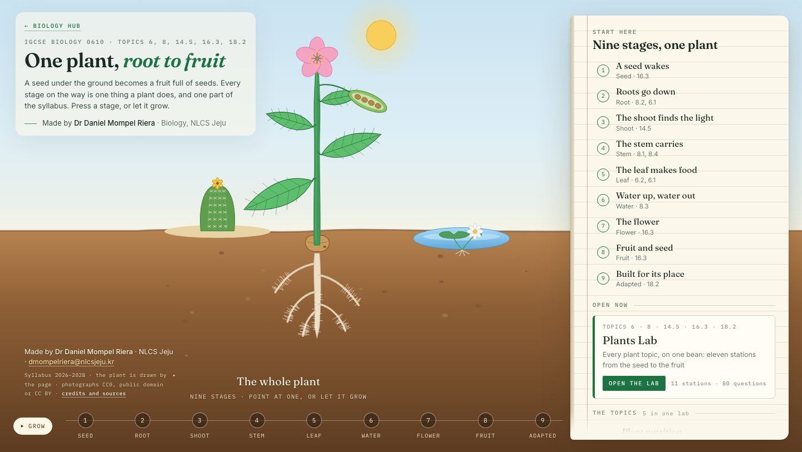

<div align="center">

<h1>🌱 &nbsp;Plants Hub</h1>

**One plant, root to fruit — the plant topics of Cambridge IGCSE Biology 0610: 6, 8, 14.5, 16.3 and 18.2.**

A bean grows in a section of ground, from a seed under the soil to a fruit full of seeds, in
nine stages. Point at a stage and that part of the plant lights and the field notebook says what
the exam wants, then what really happens. Left alone, it grows on its own.

<br>

[](https://mompel226.github.io/plants-hub/)


by **Dr Daniel Mompel Riera** · NLCS Jeju

</div>



---

## 🧭 Where this sits

This is one **shelf** of the [Biology Hub](https://mompel226.github.io/biology-hub/), the front
door to every Biology app at NLCS Jeju. A student goes front door → this shelf → a lab. The other
shelves are the [Human Body Hub](https://mompel226.github.io/human-body-hub/) (topics 7 and 9–16)
and the [Life on Earth Hub](https://mompel226.github.io/life-on-earth-hub/) (topics 1 and 17–21);
Foundations is being built. The link at the top of the page goes back up.

Behind this shelf sits one lab, the **[Plants Lab](https://mompel226.github.io/plants-lab/)**,
which covers every plant topic in eleven stations. Every stage of the plant here names the station
that teaches it and opens the lab there — the hub introduces, the lab teaches.

> [!TIP]
> **Want your students' scores in a spreadsheet of your own?**
> It is set up once, for every lab at the same time, and it is explained in the main hub:
> **[Would you like to see how your students are doing?](https://github.com/Mompel226/biology-hub#-would-you-like-to-see-how-your-students-are-doing)**

## 🧑‍🎓 For your students — there is nothing to set up

> [!TIP]
> **Send them the link and you are done.**
> [mompel226.github.io/plants-hub](https://mompel226.github.io/plants-hub/)
>
> No account, no sign-up, no install. It works on a phone, a Chromebook or a school PC.

| # | Topic | Where the lab teaches it | |
|:--:|-------|-----|:--:|
| 6 | Plant nutrition | [Plants Lab](https://mompel226.github.io/plants-lab/#leaf) · stations 4 and 5 | 🟢 live |
| 8 | Transport in plants | [Plants Lab](https://mompel226.github.io/plants-lab/#root) · stations 2, 3, 6 and 7 | 🟢 live |
| 14.5 | Tropic responses | [Plants Lab](https://mompel226.github.io/plants-lab/#tropisms) · station 8 | 🟢 live |
| 16.3 | Sexual reproduction in plants | [Plants Lab](https://mompel226.github.io/plants-lab/#flower) · stations 1, 9 and 10 | 🟢 live |
| 18.2 | Adaptive features | [Plants Lab](https://mompel226.github.io/plants-lab/#adapted) · station 11 | 🟢 live |

## 🌱 What is on the page

Nine stages, in the order a plant lives them: a seed wakes · roots go down · the shoot finds the
light · the stem carries · the leaf makes food · water up, water out · the flower · fruit and seed ·
built for its place. Each one grows the drawing a step further, lights the part that does the
work, and fills the notebook with the exam's answer first and reality after it, a photograph from
Wikimedia Commons, the lab station, and the syllabus sections it draws on. The last stage brings on
two neighbours, a cactus and a water lily, for topic 18.2.

The plant is not a picture. It is drawn by the page from one written description of its parts and
stages, and the same description draws the plate of the Plants Lab, so both show the same plant.
Sap runs in the xylem and phloem when the stem is chosen, the leaves breathe when water is, and a
seedling bends to the sun when the shoot is.

**Deep links** for projecting in class: `/#seed`, `/#leaf`, `/#flower`, `/#adapted`, or a topic:
`/#nutrition`, `/#transport`, `/#tropic`, `/#reproduction`, `/#adaptive`.

## 🛠 How it works

Static files, no build step beyond a cache stamp, no framework. GitHub Pages serves it as it is.

- **`js/topics.js` — the topic register.** The only file you edit when a lab changes.
- **`js/stages.js`** — what each stage says: the text, the line of reality, the photograph and its
  credit, the lab stations, the syllabus sections.
- **`js/plant.js` and `js/plant-draw.js`** — the plant: its parts, its growth stages, and the code
  that draws, lights, grows and animates it. Shared with the Plants Lab and copied in from
  `labs-shared/plant/` by `tools/sync-shared.mjs`; never edited here.
- `js/hub.js` frames the plant to the window, runs the stages and the notebook, tours by itself
  and opens deep links.
- `css/hub.css` — the day, the ground, the notebook, the phone.
- `js/data/labs.js` and `js/progress.js` are copied from the shared register by `tools/stamp.mjs`,
  which also stamps every `?v=` so a change reaches every browser.

```
node tools/sync-shared.mjs   # after a change to labs-shared/plant/
node tools/stamp.mjs         # before every push
```

## 🖼 Images and sources

The plant, the ground, the cactus and the water lily are drawn by the page. Every photograph is
from Wikimedia Commons, public domain, CC0 or CC BY, credited under the picture on the page and
listed with every licence in [`assets/CREDITS.md`](assets/CREDITS.md).

Made by **Dr Daniel Mompel Riera** · Biology, NLCS Jeju ·
[dmompelriera@nlcsjeju.kr](mailto:dmompelriera@nlcsjeju.kr)
